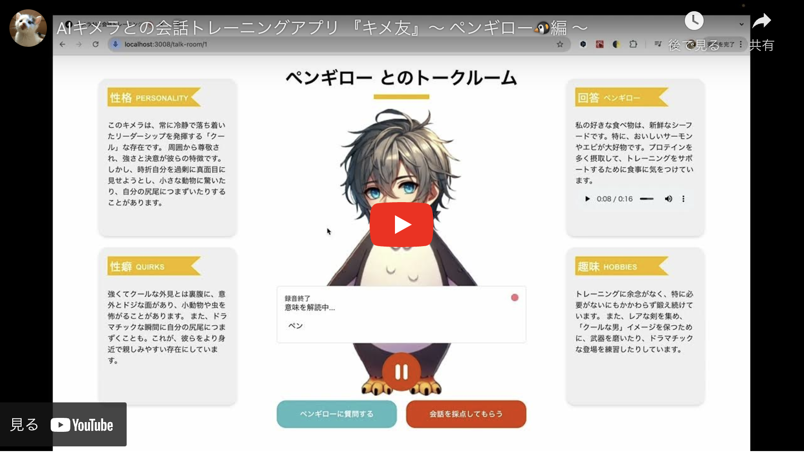

# AI Conversation Training Web App Front

- AI Conversation Training の FrontEnd

- [Qiita Hackathon 2024 (9/21~22)](https://qiita.com/official-campaigns/hackathon/2024)で開発した作品

## 君も『キメ友』になろう！

最初の『キメ友』を 3 体の中から選ぶ必要があります 🙏


## 実際のサービス画面デモ

[](https://www.youtube.com/watch?v=UMw7Bpwo26Q)

## 環境構築方法(初期 setup)

### 0. 前提条件

- API Key は .env に Set する

### 1. パッケージを install する

app ディレクトリに移動して、パッケージを install する

```bash
cd app/ && yarn install
```

### 2. .env ファイルの作成

1. `app/.env.example` を Copy して、`.env`ファイルを作成してください。

2. `NEXT_PUBLIC_OPEN_AI_API_KEY` に OpenAI の API Key を Set します。

```bash: .env
# OpenAI API key
NEXT_PUBLIC_OPEN_AI_API_KEY=your-openai-api-key

# VOICE VOX API URL
VOICE_VOX_API_URL=http://localhost:50021
```

### 3. Docker Image の Build & Docker Container の起動

1. Docker Image のビルド と コンテナの実行を実施します。

```bash
docker-compose up --build

# windowsの方はこちらのコマンドでコンテナに入りyarn devを実行して開発環境を立ち上げる。
docker container exec -it ai-conversation-training-front-frontend-1 /bin/bash
```

2. VOICE-VOX Container を立ち上げる

```bash
cd voice-vox

docker-compose up --build
```

### 4. Web ブラウザからアクセスする

http://localhost:3008/ にアクセスして App の起動を確認する

## その他

### パッケージの追加

app ディレクトリに移動して、パッケージを add する

```bash
cd app/ && yarn add パッケージ名
```

### Docker コンテナの停止 & 削除

`docker-compose down` コマンドを使用して、すべてのコンテナを停止し、削除することができます。

```bash
docker-compose down
```
